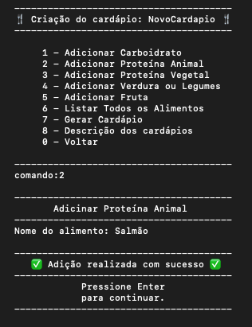
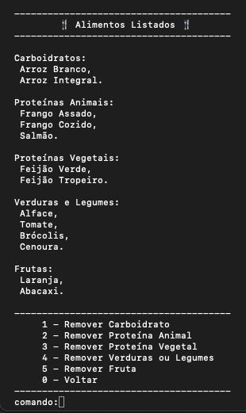
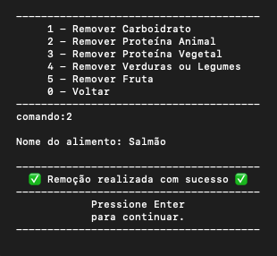
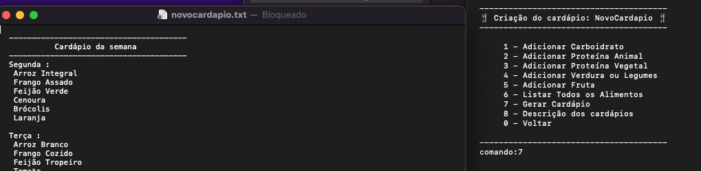
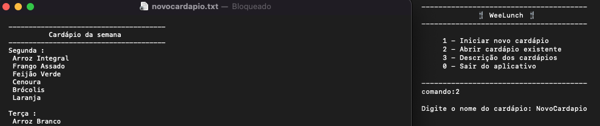

# WeeLunch 🍴

O WeeLunch possui como objetivo auxiliar as pessoas, que dispõem de pouco tempo durante o dia a dia, no planejamento dos almoços semanais. 
O programa de terminal, feito em Swift, basea-se nos alimento disponíveis para gerar um cardápio semanal de refeições, o qual visa uma alimentação equilibrada e não repetitiva.


## Pré-requisitos 📋
 - Possuir uma máquina Mac, com a versão mais recente do MacOS instalada.
 - Conter o Swift instalado.
 - Sugere-se que tenha instalado o Xcode para rodar o programa.
 

## Instalação 🔧

Clone o projeto:
```bash
  git clone https://github.com/BeatrizLdS/WeeLunchPackage.git
```
Acesse o arquivo do projeto:
```bash
  cd WeeLunchPackage/
```
Execute:
```bash
  swift run
```

    
## Usando o WeeLunch ⚙️

Inicie um novo cardápio digitando o comando 1 e nomei-o. Exemplo:


Adicione os alimentos disponíveis utilizando as opções 1, 2, 3, 4 e 5. Exemplo:


Liste todos os alimentos disponíveis selecionando a opção 6 do menu:


Para remover um alimento, no menu de listagem, escolha o alimento e remova-o como no exemplo abaixo:


Voltando para o menu de criação, gere o cardápio semanal digitando 7:


Caso feche o cardápio gerado, para abri-lo novamente, basta ir no menu inicial do programa, selecionar a opção 2 e digitar o nome do cardápio que deseja visualizar.
Conforme o exemplo:



## Desenvolvido por ✒️

- [@BeatrizLdS](https://www.github.com/BeatrizLdS)
